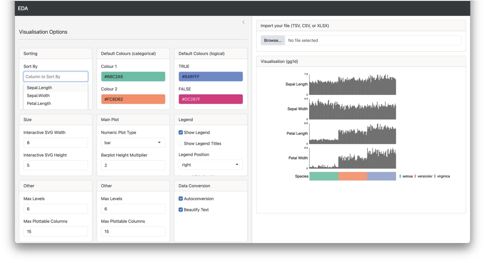

# Summary

Exploratory data analysis (EDA) involves examining relationships between both categorical and quantitative features. The gg1d R package streamlines EDA by providing two turnkey approaches to visualising n-dimensional data which can graphically reveal correlative or associative relationships between 2 or more features. For small datasets (n<1000), gg1d can represent all dataset features as distinct, vertically aligned bar or tile plots, with plot types auto-selected based on whether variables are categorical or numeric (\autoref{fig:figure1}). Since datasets with thousands of observations are often challenging to visualise in tiled layouts, gg1d also produces interactive parallel coordinate plots (PCPs) better suited for examining large datasets (\autoref{fig:figure2}). gg1d reduces the amount of code and time required to detect multi-feature relationships that may otherwise require statistical modelling or thorough manual review to identify (\autoref{fig:figure3}, \autoref{fig:figure4}).

To make gg1d visualisations accessible to a wider audience, we also developed EDA, a web app that enables non-programmers to explore and interpret data patterns interactively (Figure 5). EDA is available at [https://selkamand.github.io/EDA/](https://selkamand.github.io/EDA/). 

![**gg1d** parallel coordinate plots of the dry beans imaging dataset [@dry_bean_602]. a) Visualizing 16 morphological features of 13,611 grains from common dry bean species reveals clear correlations amongst size-related attributes (Area, Perimeter and Axis Length). Bombay beans were the largest, most convex variety; b) Highlighting a single subclass simplifies both comparison against the full cohort and identification of within-class outliers. For example, Dermason beans (red) are smaller in size than other varieties. One Dermason bean grain had unusually low roundness, highly atypical for this variety \label{fig:figure2}](figure2PCP.png)

# Statement of Need

The R ecosystem already includes popular EDA packages such as **skimr**, which textually summarizes completeness and descriptive statistics for individual features (1-dimensional), and **GGally**, which graphically describes pairwise feature correlations (2-dimensional) or multi-feature relationships through PCPs (n-dimensional). **gg1d** enhances this ecosystem by providing interactive versions of standard n-dimensional visualisations like PCPs and introducing tiled one-dimensional visualisations that more effectively show missingness and complex categorical relationships in smaller datasets. Together, these visualisations provide key advantages over other EDA packages, most notably their ability to reveal a greater variety of complex multidimensional patterns (\autoref{fig:figure3}, \autoref{fig:figure4}). 

![Comparison of R packages that create visualisations commonly used for exploratory data analysis, including ComplexHeatmap [@Gu:2022], Data Explorer [@Cui:2024], skimr [@Waring:2022], GGally [Schloerke:2024] and ggpcp [@Vander:2023]. Due to documented reproducibility issues, ggpcp features could not be verified first-hand. \label{fig:figure3}](ComparisonTable.png){width="85%"}

The benefits of **gg1d** are exemplified when visualizing the artificial Lazy Birdwatcher dataset, which records magpie observations by two birdwatchers (\autoref{fig:figure4}). One birdwatcher does not work on weekends, creating a missing data pattern dependent on both birdwatcher and day of the week. This multidimensional pattern becomes immediately apparent from the **gg1d** tile plots, whereas it is difficult to detect using one-dimensional EDA tools like **skimr**, two-dimensional tools like **ggpairs** from the **GGally** package. Despite being n-dimensional, all PCP plot implementations in R also fail to uncover this trend due to either exclusion of missing data or inability to effectively represent relationships between categorical features (data not shown). 

Despite the advancements provided by gg1d and other tools in the R ecosystem, a key limitation remains: accessibility for non-programmers, particularly when visualizing n-dimensional data. All existing R implementations lack graphical user interfaces (\autoref{fig:figure3}). While shiny web apps offer a potential solution, they often require uploading datasets to external servers, raising privacy concerns. To address these limitations, we developed EDA, a web-assembly compiled client-side web app for secure, interactive data exploration  (\autoref{fig:figure5}). Operating entirely in the browser, EDA ensures data remains on the user’s machine, increasing ease of use without compromising data privacy. EDA is available at [https://selkamand.github.io/EDA/](https://selkamand.github.io/EDA/). 

We developed gg1d and associated tools for the visualisation of clinical and multiomics data and anticipate it will prove valuable for any exploratory EDA activities. 

# Acknowledgements
We thank the developers of the packages integral to gg1d, especially David Gohel for ggiraph [@gohel:2024], which enables its interactivity, and Thomas Lin Pedersen for patchwork [@pedersen:2024] and ggplot2 maintenance. We also acknowledge Hadley Wickham and all contributors to ggplot2 [@wickham:2016]. The gg1d graphical user interface (EDA) was made possible thanks to creators and maintainers of shiny [@Chang:2024], shinylive [@Schloerke:2024:shinylive] and webR [@Stagg:2023]. 

# References